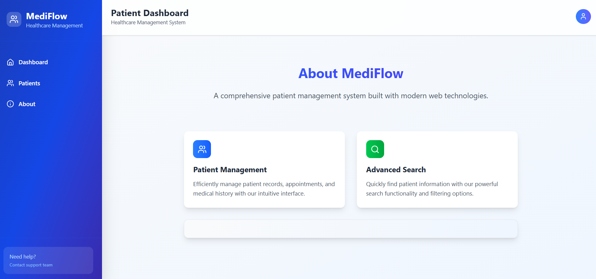
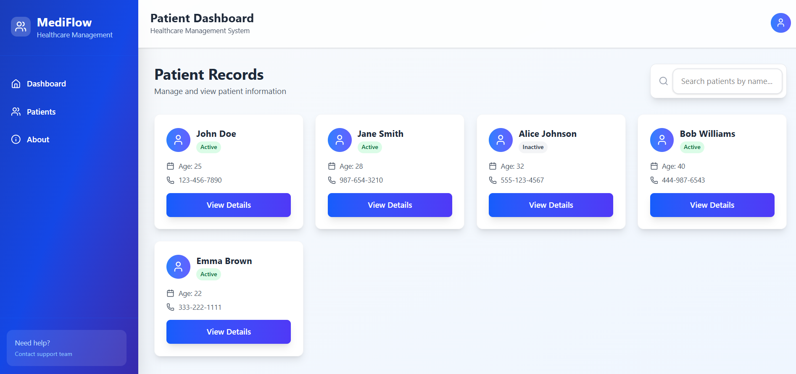
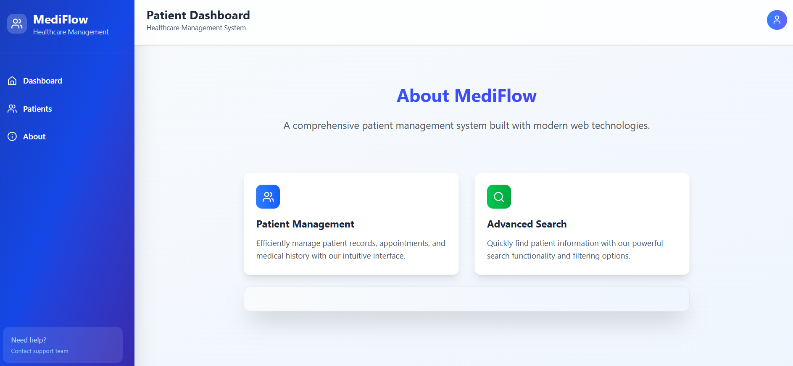

# 🩺 MediFlow – Patient Record Management System

MediFlow is a modern web-based **Patient Record System** built with **React + Vite + Tailwind CSS**.  
It helps healthcare professionals easily manage patient records, appointments, and reports — all in one intuitive dashboard.

---

## 🚀 Features

- 📋 Manage and store patient details efficiently  
- 🕒 Track medical history and appointments  
- 📱 Responsive design using **Tailwind CSS**  
- ⚡ Fast performance powered by **Vite**  
- 🧭 Navigation with **React Router DOM**  
- 🔐 Clean and modern UI for healthcare use  

---

## 🧠 Tech Stack

| Category | Technologies |
|-----------|---------------|
| Frontend | React, Vite, Tailwind CSS |
| Routing | React Router DOM |
| State Management | React Hooks / Context API |
| Deployment | GitHub Pages / Vercel |
| Version Control | Git & GitHub |

---

## 🖥️ Screenshots

### 🩹 Dashboard

### 👨‍⚕️ Patient Details Page

### 📊 Analytics / Reports

---

